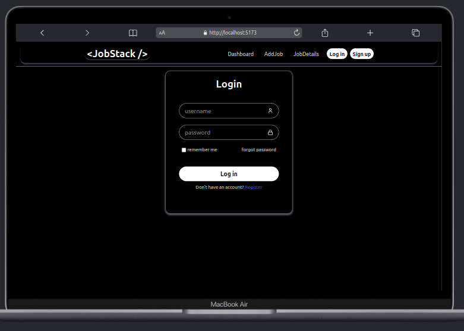
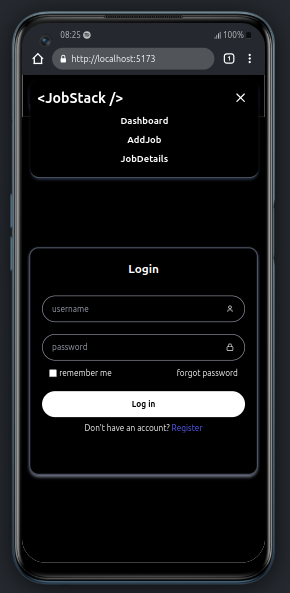
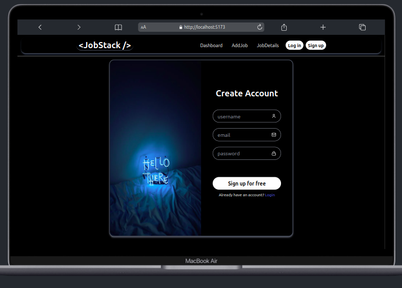
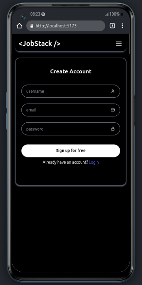
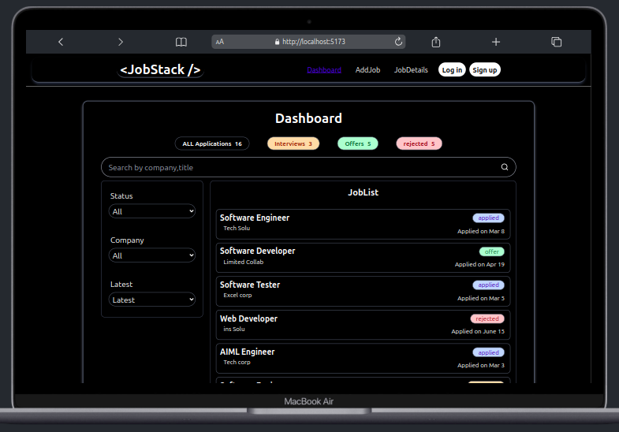
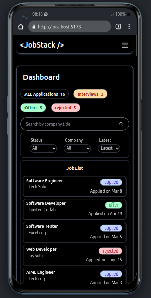

# JobStack – Job Tracker (Frontend)

JobStack is a responsive job tracking web app that helps users organize and manage their job applications with ease. It includes pages for login, signup, dashboard view, job details, and job creation – all built from scratch.

## 🚀 Features

- ✅ User Login & Signup Forms  
- 📋 Dashboard with Job Cards  
- 📝 Add New Job Form  
- 📂 Job Details View (e.g. http://localhost:5173/jobdetails/:farhan) 
- 🎯 Status Badges (e.g. Applied, Interview)  
- 🔍 Responsive layout (mobile-first)  
- 🧩 Reusable UI Components (Button, Input, Spinner, etc.)

## 🛠️ Tech Stack

- React.js
- Tailwind CSS
- React Router DOM
- React Hook Form

## 🎨 UI Preview

  
  

  
  

  
  

## 📁 Folder Structure

src/ 
├── components/ 
│ ├── Button.jsx 
│ ├── Input.jsx 
│ ├── JobCard.jsx 
| ├── LoadingSpinner.jsx 
│ ├── Navbar.jsx 
│ └── StatusBadge.jsx 
├── pages/ 
│ ├── AddJobPage.jsx 
│ ├── DashboardPage.jsx 
│ ├── JobDetailsPage.jsx 
│ ├── LoginPage.jsx 
│ └── RegisterPage.jsx 
├── App.jsx 
└── main.jsx 

# ⚙️ Setup & Run

## Clone the repository
git clone https://github.com/arbaz-karajagi/JobStack.git 
cd JobStack

## Install dependencies
npm install

## Run the app
npm run dev

## 📌 Status
🎨 Frontend – Completed  
🛠️ Backend – Coming Soon 

## 📌 To-Do (Phase 4)
🔗 Backend API (Node.js + MongoDB) 
🧩 Auth logic with JWT 
📁 Job data persistence 
🎯 Backend deployment 

## 🙋 About Me
This project was built fully from scratch as a portfolio project to practice my frontend skills, UI planning, component structuring, and form management in React.

## 📬 Contact
Feel free to connect or reach out:

💼 [LinkedIn](https://linkedin.com/in/stacksec-arbaz/) 
💻 [GitHub](https://github.com/arbaz-karajagi/) 
📧 Email: arbazkarajagi.work@gamil.com  

************************************************************************